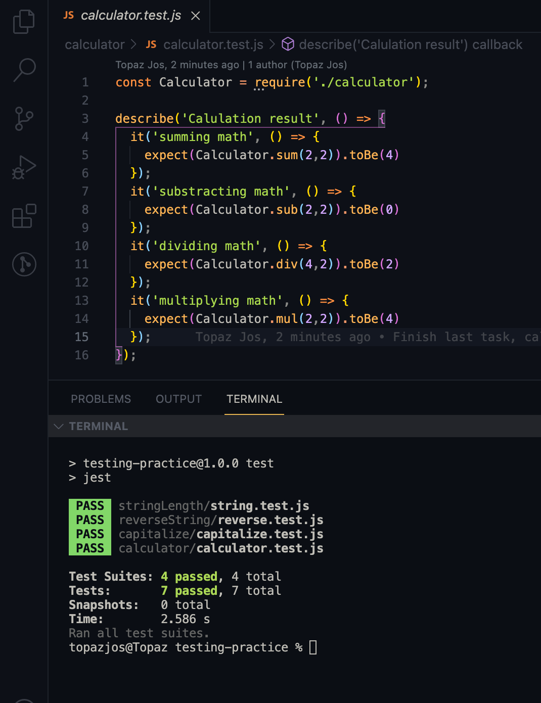

# testing-practice
In this project, we are going to creat our own funtions for different uses and implement testing for each of them

 ## View Result

> || Desktop version || 
> |-|---------|-|
> ||  ||

## Built With

- ES6 Javascript
- GitHub
- jest test runner

### Run

- run `npm test` or `yarn test` to run the test

## Authors

👤 **Jos Kalenda**

- GitHub: [Jos Kalenda](https://github.com/)
- Twitter: [Jos Kalenda](https://twitter.com/)
- LinkedIn: [Jos Kalenda](https://www.linkedin.com/)

## 🤝 Contributing

Contributions, issues, and feature requests are welcome!

Feel free to check the [issues page](https://github.com/joskalenda/to-do-list/issues/new.

## Show your support

Give a ⭐️ if you like this project!

## 📝 License

This project is [MIT](./MIT.md) licensed.

